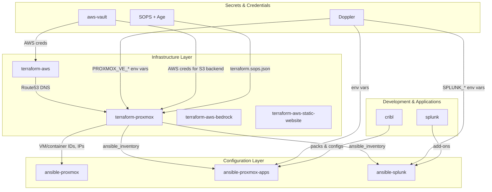
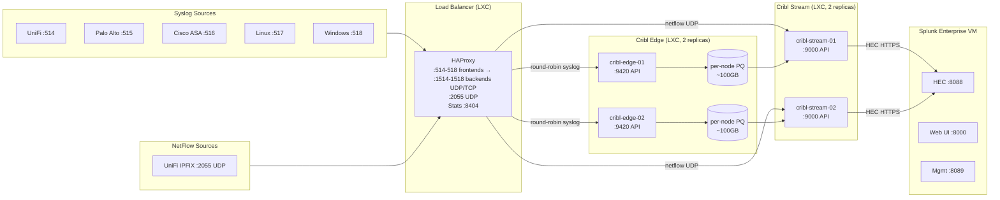
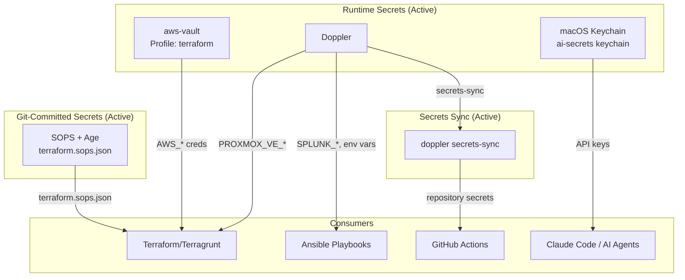

# Infrastructure Architecture

Canonical architecture reference for the Proxmox homelab ecosystem.
All other repositories link here; this is the single source of truth.

## Repository Dependency Graph



## Data Pipeline Flow



**Cribl two-tier rationale**: Edge nodes own ingestion + persistent queueing
(absorbs upstream bursts, survives Splunk outages). Stream nodes own routing
and central pipeline logic (sourcetype enrichment, HEC output). Both run as
LXC containers in the `logging` resource pool — no Docker Swarm in this path.

## Secrets Chain



## Infrastructure Components

### Proxmox VE Host

Single-node hypervisor running VMs and LXC containers.
Managed by `ansible-proxmox` (kernel, ZFS, monitoring, firewall, Samba NAS).

**Host services declared in `deployment.json`** (`host_services.nas`):

- ZFS dataset `rpool/data/nas` mounted at `/mnt/nas` (1 TB quota)
- Samba shares: `nas` (general), `ha-media`, `ha-backups`
- Directories under `/mnt/nas`: `media`, `backups`, `huggingface/hub`,
  `ollama/models`
- SMB user `homeassistant` for HA integration writes to `ha-media` /
  `ha-backups`

### VMs (terraform-proxmox)

Provisioned via BPG Proxmox Terraform provider. IPs derived from VM ID:
`network_prefix.vm_id` (e.g., VM 200 = `192.168.0.200`).

| Resource      | VM ID | Purpose                                                                     |
| ------------- | ----- | --------------------------------------------------------------------------- |
| `splunk-aio`  | 200   | Splunk Enterprise (Docker) — see `modules/splunk-vm/`                       |
| `docker-host` | 250   | Docker host for ephemeral GitHub Actions runners and other Docker workloads |

Cribl Edge and Cribl Stream were previously planned for Docker Swarm on
`docker-host` but now run as dedicated LXC containers (see below).

### LXC Containers (terraform-proxmox)

Authoritative list lives in `deployment.json` `containers.*` — the source of truth
for infrastructure (private, in the on-prem `s3` store; see
[the source-of-truth rule](../agentsmd/rules/infra/deployment-json-source-of-truth.md)).
Summary by pool:

- **`infrastructure`** — `ansible`, `pve-scripts-local`, `technitium-dns`,
  `pi-hole`, `phpipam`, `apt-cacher-ng`, `object-storage` (RustFS, hostname
  `s3`), `mailpit`, `ntfy`, `homeassistant`, `mssql`, `nginx-proxy-manager`,
  `prometheus`, `traefik` (HTTPS/TLS ingress)
- **`logging`** — `haproxy`, `cribl-edge-01/02`, `cribl-stream-01/02`,
  `splunk-mgmt` (SH + DS + LM + MC + CM)
- **`ai`** — `qdrant`, `llamaindex`,
  `hermes-infer` (Ollama LLM inference on the RX 6800 GPU), `hermes-chat`
  (Open WebUI chat frontend), `dify`, `langflow` (LLM orchestration / flow
  builders), `agent-exec` (CrewAI + LangChain runtime with OpenLLMetry tracing)
- **`media`** (v1 pinned to the primary media node — `node_name`,
  `node_storage`, and ansible inventory label all aligned on that node;
  v2 lives on the secondary media node) — `download-vpn` (qBittorrent +
  Prowlarr behind Proton WireGuard with an nftables killswitch), `sonarr`,
  `radarr`, `plex`, `seerr`

Notable per-container facts:

- `haproxy` LXC fronts syslog 514-518 (UDP/TCP → Cribl Edge backends 1514-1518)
  and NetFlow 2055 (UDP) — see [LOGGING_PIPELINE.md](./LOGGING_PIPELINE.md).
- `cribl-edge-01/02` (API 9420) + `cribl-stream-01/02` (API 9000) form the
  two-tier pipeline.
- `splunk-mgmt` runs the Splunk management roles (SH/DS/LM/MC/CM); the
  `splunk-aio` VM 200 is the dedicated indexer.
- `hermes-infer` is a **privileged** LXC with the AMD RX 6800 passed through
  (`/dev/kfd` + `/dev/dri`, via `ansible-proxmox` `lxc_gpu_features`) running
  Ollama on ROCm; it serves `hermes4` (NousResearch Hermes-4-14B) on port 11434
  from a 120 GB `/var/lib/ollama` volume.
  `hermes-chat` runs Open WebUI (`llm` ingress); `ollama` exposes the raw API.
  Full write-up: [local-llm](https://docs.jacobpevans.com/infrastructure/local-llm).
- The **AI orchestration tier** — `dify`/`langflow` (Traefik-fronted) and
  `agent-exec` on the `ai` VLAN, plus `langfuse` (Langfuse v3 observability on the
  **siem** VLAN, `infrastructure` pool, OTLP ingest `:3000/api/public/otel`) —
  emits OpenTelemetry to Cribl Edge, which forks traces to Langfuse + Splunk. Each
  tool's model endpoint resolves by DNS to an OpenAI-compatible runner, so the
  backend is swappable. **Tools evaluated:** n8n — not adopted; Community Edition
  gates needed features and paid tiers cost more than self-hosted even on-prem.
- `mailpit` and `ntfy` run Docker-in-LXC (`nesting: true`, `keyctl: true`) for
  internal notifications.
- `download-vpn` is an unprivileged LXC with `/dev/net/tun` passed through
  (`device_passthrough`) so WireGuard creates `wg0` inside it. The unified
  `bulk/data` dataset is bind-mounted from the media-node host as `/data`
  (size-less `mount_points`) so torrents and the library hardlink with zero
  duplication (`ansible-proxmox` `zfs_pools` provisions it; `media_lxc_features`
  applies the mount). Egress is VPN-locked by an in-LXC nftables killswitch
  (`ansible-proxmox-apps` `download_vpn` role); no Proxmox firewall on the media
  pool — the killswitch is the boundary.
- `sonarr`, `radarr`, `plex` are LAN-only (no VPN); they reach Prowlarr +
  qBittorrent on `download-vpn` over the LAN and read/write the same unified
  `bulk/data` (`/data`) dataset.
- `traefik` (VMID 101) is the HTTPS reverse-proxy / TLS ingress on the management
  VLAN (VLAN 5), co-located with `haproxy`; other-VLAN backends are reached via
  inter-VLAN routing (UniFi allow rules per UI port). It fronts every web UI at
  `https://<name>.<subdomain>` and auto-renews a wildcard `*.<subdomain>` Let's
  Encrypt cert via Route53 DNS-01 (lego) — no inbound internet. Install, dynamic
  routers (from this inventory), and certs are owned by the `ansible-proxmox-apps`
  `traefik` role; supersedes the legacy `nginx-proxy-manager`.

#### Client reachability of `<name>.<subdomain>`

For a client anywhere on the network to reach `https://<name>.<subdomain>`, name
resolution has to point at Traefik. The gateway is each client's DNS resolver, so
it **conditionally forwards the internal ingress `<subdomain>` to the internal DNS
resolver** (Technitium) and resolves everything else (public names) itself. The
internal resolver is authoritative for that subdomain and answers every
`<name>.<subdomain>` with Traefik's address; Traefik then routes by `Host` header
and serves the wildcard `*.<subdomain>` certificate. A single gateway forward rule
covers every current and future service name, since they all resolve to Traefik.

#### Notification Services

Mailpit (VM ID 110) and ntfy (VM ID 111) provide internal notification delivery:

- **Mailpit** (`192.168.x.110`): SMTP relay on port 1025, web UI on port 8025. Captures outbound emails from internal services for inspection and relaying.
- **ntfy** (`192.168.x.111`): HTTP push notification server on port 8080. Provides topic-based pub/sub notifications for internal alerting.

Both containers run Docker-in-LXC (`nesting: true`, `keyctl: true`) and are tagged `notifications` for firewall group membership.

### Terraform Modules

| Module | Purpose |
| --- | --- |
| `proxmox-vm` | Generic VM provisioning |
| `proxmox-container` | LXC container provisioning |
| `proxmox-pool` | Resource pool management |
| `splunk-vm` | Splunk-specific VM with Docker |
| `firewall` | Proxmox firewall rules |
| `storage` | Datastore configuration |
| `acme-certificate` | Let's Encrypt via Route53 |
| `security` | Security policies |

### State Management

- **Backend**: S3 + DynamoDB (us-east-2)
- **Encryption**: Enabled at rest
- **Locking**: DynamoDB table per repo
- **Credential**: aws-vault (never stored in files)

## Downstream Inventory Flow

terraform-proxmox produces `ansible_inventory` output consumed by Ansible repos.
Every `terragrunt apply` publishes it **natively** to the versioned state bucket
(`inventory_publish.tf`, `aws_s3_object`); consumers resolve it S3-first with
only AWS read creds. The after-hook then validates and handles the rest:

```bash
# Validate + distribute what Terraform can't (versioned-mirror PR, local
# cache-warming); rejects a partial output. Runs automatically post-apply.
./scripts/sync-inventory.sh
```

The inventory includes:

- `containers` - LXC containers with `proxmox_pct_remote` connection
- `vms` - VMs with SSH connection
- `docker_vms` - VMs tagged "docker" (subset of vms)
- `splunk_vm` - Dedicated Splunk VM
- `constants` - Pipeline port definitions from `locals.tf`

## Tool Chain

All Terraform commands require the full toolchain wrapper:

```text
nix develop → aws-vault exec → doppler run → terragrunt <command>
```

- **Nix**: Consistent tool versions (Terraform, Terragrunt, Ansible)
- **aws-vault**: AWS credentials for S3 backend
- **Doppler**: Proxmox API credentials (`PROXMOX_VE_*` env vars)
- **Terragrunt**: Wrapper with remote state and provider generation

## Related Documentation

- [LOGGING_PIPELINE.md](./LOGGING_PIPELINE.md) - Detailed syslog pipeline
- [SECRETS_ROADMAP.md](./SECRETS_ROADMAP.md) - Unified secrets strategy
- [INFISICAL_PLANNING.md](./INFISICAL_PLANNING.md) - Self-hosted secrets manager planning
