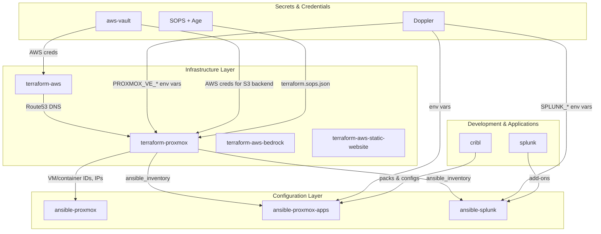
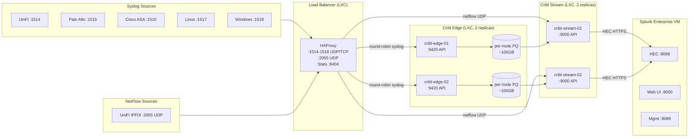
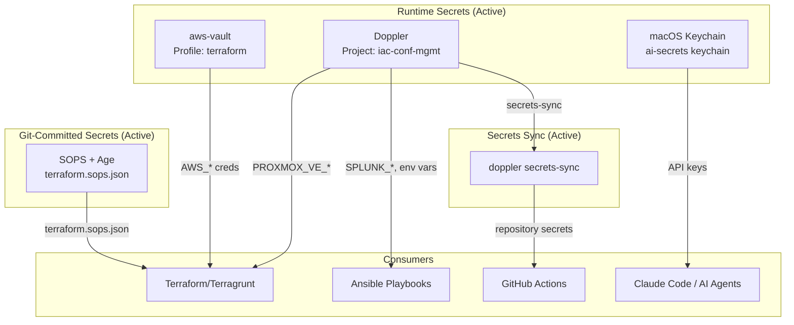

# Infrastructure Architecture

Canonical architecture reference for the Proxmox homelab ecosystem.
All other repositories link here; this is the single source of truth.

## Repository Dependency Graph



## Data Pipeline Flow



**Cribl two-tier rationale**: Edge nodes own ingestion + persistent queueing
(absorbs upstream bursts, survives Splunk outages). Stream nodes own routing
and central pipeline logic (sourcetype enrichment, HEC output). Both run as
LXC containers in the `logging` resource pool — no Docker Swarm in this path.

## Secrets Chain



## Infrastructure Components

### Proxmox VE Host

Single-node hypervisor running VMs and LXC containers.
Managed by `ansible-proxmox` (kernel, ZFS, monitoring, firewall, Samba NAS).

**Host services declared in `deployment.json`** (`host_services.nas`):

- ZFS dataset `rpool/data/nas` mounted at `/mnt/nas` (1 TB quota)
- Samba shares: `nas` (general), `ha-media`, `ha-backups`
- Directories under `/mnt/nas`: `media`, `backups`, `huggingface/hub`,
  `ollama/models`
- SMB user `homeassistant` for HA integration writes to `ha-media` /
  `ha-backups`

### VMs (terraform-proxmox)

Provisioned via BPG Proxmox Terraform provider. IPs derived from VM ID:
`network_prefix.vm_id` (e.g., VM 200 = `192.168.0.200`).

| Resource      | VM ID | Purpose                                                                     |
| ------------- | ----- | --------------------------------------------------------------------------- |
| `splunk-aio`  | 200   | Splunk Enterprise (Docker) — see `modules/splunk-vm/`                       |
| `docker-host` | 250   | Docker host for ephemeral GitHub Actions runners and other Docker workloads |

Cribl Edge and Cribl Stream were previously planned for Docker Swarm on
`docker-host` but now run as dedicated LXC containers (see below).

### LXC Containers (terraform-proxmox)

Authoritative list lives in `deployment.json` `containers.*`. Summary by pool:

- **`infrastructure`** — `ansible`, `pve-scripts-local`, `technitium-dns`,
  `pi-hole`, `phpipam`, `apt-cacher-ng`, `minio`, `mailpit`, `ntfy`,
  `homeassistant`, `mssql`, `nginx-proxy-manager`, `prometheus`
- **`logging`** — `haproxy`, `cribl-edge-01/02`, `cribl-stream-01/02`,
  `splunk-mgmt` (SH + DS + LM + MC + CM)
- **`ai`** — `claude-code-01/02`, `gemini-01/02`, `qdrant`, `llamaindex`
- **`media`** (v1 pinned to the primary media node — `node_name`,
  `node_storage`, and ansible inventory label all aligned on that node;
  v2 lives on the secondary media node) — `download-vpn` (qBittorrent +
  Prowlarr behind Proton WireGuard with an nftables killswitch), `sonarr`,
  `radarr`, `plex`, `seerr`, `traefik` (HTTPS/TLS ingress)

Notable per-container facts:

- `haproxy` LXC fronts syslog 1514-1518 (UDP/TCP) and NetFlow 2055 (UDP) — see
  [LOGGING_PIPELINE.md](./LOGGING_PIPELINE.md).
- `cribl-edge-01/02` (port 9420 API) and `cribl-stream-01/02` (port 9000 API)
  form the two-tier processing pipeline.
- `splunk-mgmt` is the LXC search head + deployment server + license manager +
  monitoring console + cluster manager. The `splunk-aio` VM 200 is the
  dedicated indexing node.
- `mailpit` and `ntfy` run Docker-in-LXC (`nesting: true`, `keyctl: true`) for
  internal notifications.
- `download-vpn` is an unprivileged LXC with `/dev/net/tun` passed through
  (`device_passthrough`) so WireGuard can create `wg0` inside the container.
  `rpool/data/downloads` and `rpool/data/media` are bind-mounted from the media-node host
  (size-less `mount_points`); the `ansible-proxmox` `zfs_pools` role provisions
  these datasets ahead of LXC creation. Egress is locked to the VPN by an in-LXC
  nftables killswitch (config + continuous validation owned by
  `ansible-proxmox-apps` `download_vpn` role); Proxmox-level firewall is
  intentionally not applied to the media pool — the killswitch is the security
  boundary.
- `sonarr`, `radarr`, `plex` are LAN-only (no VPN); they reach Prowlarr +
  qBittorrent on `download-vpn` over the LAN and read/write the same
  bind-mounted `rpool/data/*` datasets.
- `traefik` (VMID 215) is the HTTPS reverse-proxy / TLS ingress, on the media
  VLAN so it reaches the media UIs at layer 2 (other VLANs' UIs route in). It
  fronts every service web UI at `https://<name>.pve.<domain>` (no ports) and
  fetches + auto-renews a wildcard `*.pve.<domain>` Let's Encrypt certificate
  itself via the Route53 DNS-01 challenge (lego) — no inbound internet required.
  Install, dynamic routers (generated from this inventory), and the cert
  lifecycle are owned by the `ansible-proxmox-apps` `traefik` role; it
  supersedes the legacy `nginx-proxy-manager` LXC.

#### Notification Services

Mailpit (VM ID 110) and ntfy (VM ID 111) provide internal notification delivery:

- **Mailpit** (`192.168.x.110`): SMTP relay on port 1025, web UI on port 8025. Captures outbound emails from internal services for inspection and relaying.
- **ntfy** (`192.168.x.111`): HTTP push notification server on port 8080. Provides topic-based pub/sub notifications for internal alerting.

Both containers run Docker-in-LXC (`nesting: true`, `keyctl: true`) and are tagged `notifications` for firewall group membership.

### Terraform Modules

| Module | Purpose |
| --- | --- |
| `proxmox-vm` | Generic VM provisioning |
| `proxmox-container` | LXC container provisioning |
| `proxmox-pool` | Resource pool management |
| `splunk-vm` | Splunk-specific VM with Docker |
| `firewall` | Proxmox firewall rules |
| `storage` | Datastore configuration |
| `acme-certificate` | Let's Encrypt via Route53 |
| `security` | Security policies |

### State Management

- **Backend**: S3 + DynamoDB (us-east-2)
- **Encryption**: Enabled at rest
- **Locking**: DynamoDB table per repo
- **Credential**: aws-vault (never stored in files)

## Downstream Inventory Flow

terraform-proxmox produces `ansible_inventory` output consumed by Ansible repos:

```bash
# Regenerate, validate, and distribute (writes tofu_inventory.json to each
# downstream repo + a versioned commit to int_homelab; rejects a partial output)
./scripts/sync-inventory.sh
```

The inventory includes:

- `containers` - LXC containers with `proxmox_pct_remote` connection
- `vms` - VMs with SSH connection
- `docker_vms` - VMs tagged "docker" (subset of vms)
- `splunk_vm` - Dedicated Splunk VM
- `constants` - Pipeline port definitions from `locals.tf`

## Tool Chain

All Terraform commands require the full toolchain wrapper:

```text
nix develop → aws-vault exec → doppler run → terragrunt <command>
```

- **Nix**: Consistent tool versions (Terraform, Terragrunt, Ansible)
- **aws-vault**: AWS credentials for S3 backend
- **Doppler**: Proxmox API credentials (`PROXMOX_VE_*` env vars)
- **Terragrunt**: Wrapper with remote state and provider generation

## Related Documentation

- [LOGGING_PIPELINE.md](./LOGGING_PIPELINE.md) - Detailed syslog pipeline
- [SECRETS_ROADMAP.md](./SECRETS_ROADMAP.md) - Unified secrets strategy
- [INFISICAL_PLANNING.md](./INFISICAL_PLANNING.md) - Self-hosted secrets manager planning
