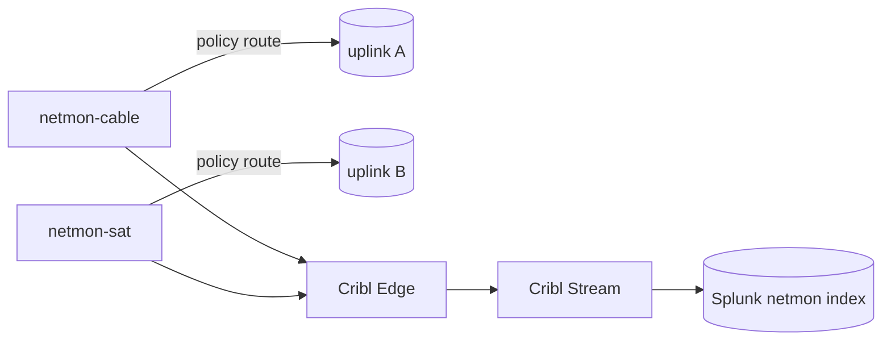

# Per-WAN Network Diagnosis

## Purpose

Per-uplink probers that record active-probe and per-link source telemetry into Splunk, so a
degraded uplink can be identified from data. This file documents the IaC scaffolding only; the
probing agents are configured by the downstream Ansible role.

## Architecture

Each uplink gets a lightweight prober LXC (Docker-in-LXC, mgmt VLAN, tag `netmon`). One Telegraf
agent per prober runs the active probes and reads its link's device, then pushes to the existing
Cribl → Splunk pipeline.

| Prober | vm_id | Uplink type | Source telemetry |
| --- | --- | --- | --- |
| `netmon-cable` | 197 | DOCSIS / cable | modem SNMP (power, MER/SNR, codewords, T3/T4 timeouts) |
| `netmon-sat` | 198 | satellite | dish gRPC exporter (obstruction %, outages, latency) |
| `netmon-lte` | optional | LTE | light probing only (metered link) |

Telegraf inputs per prober (all native — no custom scripts):

- `inputs.ping` — ICMP latency / loss / jitter to the link gateway + public anycast resolvers
- `inputs.dns_query` — DNS resolution RTT
- `inputs.http_response` — HTTPS response time
- `inputs.snmp` — DOCSIS-IF / DOCS-IF3 MIB on a cable modem
- `inputs.prometheus` — scrapes the satellite gRPC exporter and the speedtest-exporter
- `outputs.http` — Splunk-HEC format → Cribl Edge → Cribl Stream → Splunk `netmon` index

## Implementation choices

- **One Telegraf agent per prober** — a single agent natively covers ping/dns/http + SNMP +
  Prometheus scrape, so no per-probe exporters are needed.
- **Reuses the existing Cribl → Splunk pipeline** instead of adding a new metrics path.
- **Firewall via the existing `monitoring` tag** — the probers inherit the open-egress monitoring
  rules with no module change.

## Per-uplink routing dependency

A device diagnostic IP (commonly `192.168.100.1`) is shared across uplinks, so a prober reaches
*its* link's device only when its traffic egresses the assigned uplink. A source-IP policy route
per prober (owned by `tofu-unifi`) provides that. Until those routes apply, a prober measures the
default-route uplink only; the per-link source counters still populate.

## Splunk: the `netmon` index

Defined in [`SPLUNK_INDEXES.md`](./SPLUNK_INDEXES.md); created by the `ansible-splunk` role. Probe
data is high-volume, so the index uses **90-day** retention — separate from the 365-day
security-log indexes.

## Cross-repo ownership

| Work | Repo |
| --- | --- |
| netmon LXC definitions, `netmon` index doc, ports | terraform-proxmox (this) |
| Telegraf + exporter + SmokePing container config | ansible-proxmox-apps |
| `netmon` Splunk index creation | ansible-splunk |
| Per-uplink source-IP policy routes | tofu-unifi (gated apply) |

## Prerequisites and caveats

- Device SNMP (or an HTTP stats page) must be reachable from the prober; otherwise telemetry
  degrades to active probing only.
- All collection uses native Telegraf inputs and off-the-shelf exporters — no custom scripts.

## Related documentation

- [SMOKEPING.md](./SMOKEPING.md) — aggregate latency/loss/jitter RRD dashboard
- [LOGGING_PIPELINE.md](./LOGGING_PIPELINE.md) — syslog/NetFlow → Cribl → Splunk architecture
- [SPLUNK_INDEXES.md](./SPLUNK_INDEXES.md) — index definitions and retention
