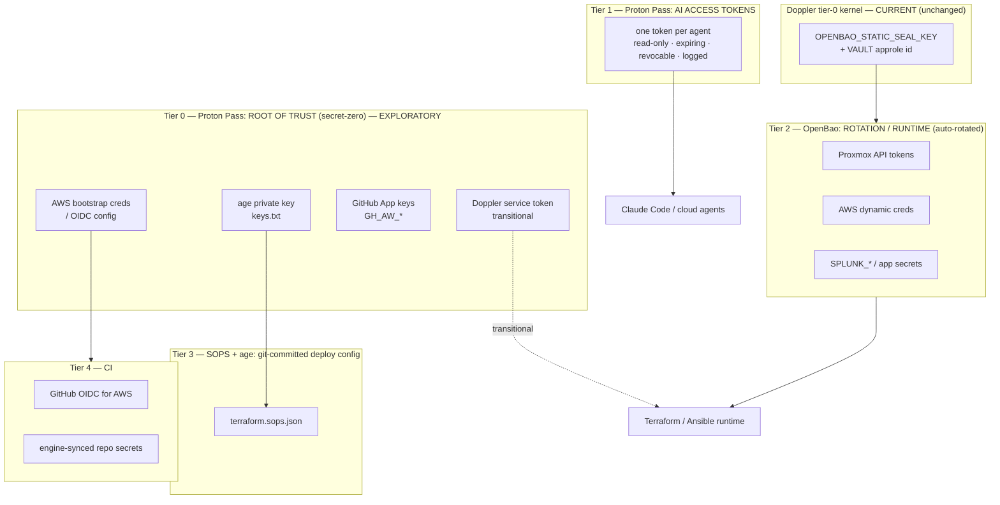

# Proton Pass — Secrets Root-of-Trust & AI-Agent Keychain (Exploratory)

> **⛔ SUPERSEDED (2026-07-01).** The four-tier secrets ADR removes Proton Pass
> from the machine architecture entirely. Proton Pass stays a **personal,
> human-only** tool and holds **no machine or AI secret-zero**. The human tier of
> record is **Bitwarden (T4)**; OpenBao secret-zero (seal key + flow-lock AppRole
> `secret_id`) lives in **Doppler (T3)**; the primary machine/AI runtime engine is
> **OpenBao (T2)**. The exploratory Tier-0 root-of-trust / Tier-1 AI-keychain roles
> below are **not adopted** and will not be. The body is retained for history only;
> the authoritative design is [SECRETS_ROADMAP.md](./SECRETS_ROADMAP.md).
>
> *(Historical status, when this was a live proposal: Exploratory — NOT
> implemented. Nothing below ever reached production.)*

Cross-repo *proposal* for using the **Proton Pass CLI** as a portable,
end-to-end-encrypted **root-of-trust** for the Proxmox homelab ecosystem, and as
an **auditable keychain for AI agents**.

> Companion to [SECRETS_ROADMAP.md](./SECRETS_ROADMAP.md). This document owns the
> exploratory Proton Pass tier; the roadmap owns the overall picture.

## Why Proton Pass, and only for this

The secrets stack has sprawled to five active systems (Doppler, aws-vault,
a separate `ai-secrets` macOS Keychain, SOPS+age, GitHub Actions tokens) plus two
planned (Infisical, OpenBao). Three concrete problems motivate this:

1. **Several stores are macOS-only.** aws-vault's Keychain backend and the
   `ai-secrets` Keychain do not exist on the Linux **cloud agents** this repo now
   runs in. Anything bootstrapped from them is unavailable off-Mac.
2. **The age private key has no documented home.** `~/.config/sops/age/keys.txt`
   is "generate it, don't commit it" — there is no portable, backed-up,
   recoverable source of truth for the one key that decrypts all committed config.
3. **No story for many AI agents.** A growing fleet of Claude Code / cloud agents
   shares one keychain entry: no per-agent scoping, expiry, revocation, or audit.

Proton Pass CLI (GA, GPLv3, cross-platform — Linux/macOS/Windows) is used **only**
where it is genuinely best:

- **Tier 0 — root-of-trust:** holds every long-lived *secret-zero* in one
  portable, e2e-encrypted, audited vault, reachable identically on a laptop or a
  Linux cloud agent.
- **Tier 1 — AI-agent keychain:** Proton Pass **AI Access Tokens** give each agent
  a read-only, expiring, reason-tagged, individually-revocable, logged credential.

Proton Pass is deliberately **not** the rotation engine or runtime injector — it
has **no native rotation** and **no service-account REST API** (PATs are
user-scoped). Those jobs belong to OpenBao and Doppler/SOPS respectively.

## Target architecture (tiers)



**If adopted, Proton Pass would own Tier 0 + Tier 1 only.** The OpenBao seal key
stays in the **Doppler tier-0 kernel** (a cold cluster must be able to unseal
itself without Proton), and Tiers 2–4 already track the roadmap's reconciled
destination.

## The `pass://` reference convention

Every secret-zero item is addressed by a stable reference, committed (paths only,
no values) in [`.proton-pass.refs.json`](../.proton-pass.refs.json) at the repo
root — analogous to `.sops.yaml` holding only the public key. Format:

```text
pass://<vault>/<item>/<field>
```

All repos and agents resolve the **same** references, so there is one canonical
location per secret. Retrieval uses the Proton Pass CLI:

| Need | Command (confirm flags against the CLI docs¹) |
| --- | --- |
| Fetch one field to stdout/file | `pass read "pass://infra/sops-age/keys.txt"` |
| Inject secrets as env for a command | `pass run -- <command>` |
| Expand a template file | `pass inject -i tmpl -o out` |
| Machine-readable output | append `--output json` |

¹ Command/flag names follow the official docs at
<https://protonpass.github.io/pass-cli/>. Treat that as the source of truth and
adjust the wrapper script if a subcommand differs.

## AI Access Token policy (Tier 1)

Replaces the shared `ai-secrets` macOS Keychain entry. For every AI agent:

- **One token per agent identity** (per Claude Code instance / cloud-agent fleet
  member) — never a shared token.
- **Read-only**, scoped to the **minimum** vault/items the agent needs.
- **Mandatory expiry ≤ 90 days** (Proton enforces expiry; we set the policy).
- **Reason-tagged** on every access; **activity logged** centrally.
- **Revocable immediately** — compromise or offboarding revokes one token, not the
  fleet.

Because the account is **Proton Family/Unlimited**, minting tokens is **unlimited
and free** — there is no per-agent or per-repo seat cost. This is the direct
answer to the "lots of AIs / accounts / integrations / repos" limit concern.

## Rotation strategy

Proton Pass holds the *bootstrap* secret for each system; rotation of the live
credentials is owned by the engine, not the vault.

| Secret | Mechanism | Cadence |
| --- | --- | --- |
| Proxmox API tokens | OpenBao + scripted create/delete via Proxmox API → written to engine | 30–90d |
| AWS access | GitHub OIDC (CI) + OpenBao AWS dynamic creds — no static keys | short TTL / on-demand |
| age private key | `sops updatekeys` then update the Proton item | on personnel/device change |
| AI agent tokens | Proton AI Access Tokens, mandatory expiry | ≤90d auto-expire |
| Proton PATs | scoped per vault/item, mandatory expiry | ≤1y |

## Affordability & limits

- **No per-agent / per-repo cost.** One Family/Unlimited account mints unlimited
  scoped PATs + AI Access Tokens. Avoids Doppler/1Password per-seat scaling as
  agents and repos multiply.
- **Free engines.** OpenBao (self-hosted), SOPS, and GitHub OIDC carry the
  rotation/runtime plane at $0 software cost.
- **Net.** The only paid component (Proton, already owned) covers the human +
  AI-agent root-of-trust; everything that scales with repo/agent count is free.

## Reconciliation with the existing roadmap

This proposal does **not** alter the current roadmap; it would layer on top of it
if adopted:

- **OpenBao and Infisical stay domain-split** per the roadmap — OpenBao is the
  machine/IaC/dynamic-secrets engine, Infisical the human UI + developer hub, with
  no sync between them. This document does not supersede either.
- **The OpenBao seal key stays in the Doppler tier-0 kernel**, unchanged. Proton
  Pass would never hold it.
- **`ai-secrets` macOS Keychain remains the current AI-agent store.** Tier 1 AI
  Access Tokens are a *candidate* cross-platform + audited successor, not a live
  replacement.
- **SOPS+age and Doppler are unchanged.** The only thing this proposal would move
  is the age key's *home* (into Proton Pass) — and only if adopted.

## Rollout sequence (only if adopted)

1. **Foundation.** Proton Pass becomes a portable home for the age key and other
   secret-zero; [`scripts/secrets-bootstrap.sh`](../scripts/secrets-bootstrap.sh)
   materializes it cross-platform; docs updated. No runtime/HCL change.
2. **Tier 2 — OpenBao on Proxmox** + Proxmox-token rotation job (separate effort;
   already tracked as PLANNED-FOR-DEPLOY in the roadmap).
3. **Tier 4 — GitHub OIDC for AWS** + engine-synced repo secrets (retire
   `secrets-sync`).
4. **Per-repo rollout** of the bootstrap + AI-token model to `ansible-proxmox*`,
   `ansible-splunk`, `terraform-aws*`.

## References

- Proton Pass CLI docs — <https://protonpass.github.io/pass-cli/>
- Proton Pass CLI source (GPLv3) — <https://github.com/protonpass/pass-cli>
- Proton Pass AI Access Tokens — <https://proton.me/blog/pass-access-tokens>
- OpenBao — <https://openbao.org/>
